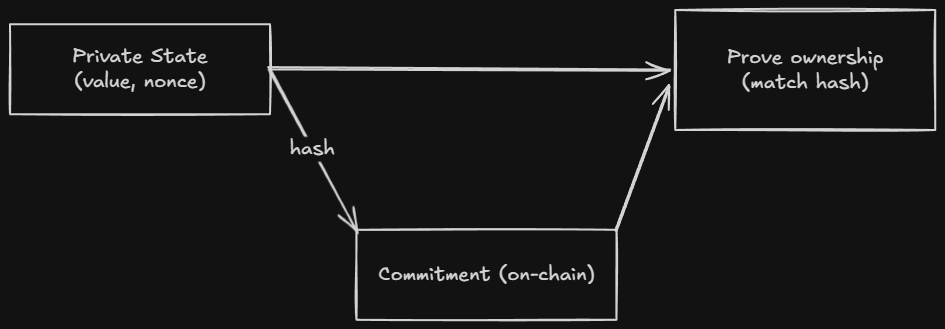

# Ledger State

The ledger is the on-chain, public state of a Compact contract.

> Sources: [Ledger ADT](https://docs.midnight.network/compact/reference/ledger-adt), [Compact Reference](https://docs.midnight.network/compact/reference/compact-reference#declaring-and-maintaining-public-state)

## The Two Worlds

| | `export ledger` | Private state |
|--|-----------------|---------------|
| Where it lives | Every node on the network | User's local storage |
| Who can read it | Anyone | Only the owner |
| On-chain representation | Plaintext value | Cryptographic commitment |
| How it's updated | Direct ledger assignment | Via ZK proof |

**Privacy is the default in Compact. Disclosure is an explicit exception.**

## Ledger State Updates


## Commitment Pattern



**Key insight:** Store the hash on-chain, keep the value off-chain. Prove knowledge of the value without revealing it.

## Declaring Ledger Fields

```compact
ledger val: Field;
export ledger cnt: Counter;
sealed ledger config: Uint<32>;
export sealed ledger mapping: Map<Boolean, Field>;
```

- `ledger`: declares a public on-chain field
- `export`: makes the field readable from TypeScript
- `sealed`: can only be written during initialization

All ledger fields initialize to their type's default. The constructor can override them.

## The `disclose()` Boundary

`disclose()` is a compile-time annotation, it does not encrypt. It tells the compiler you are intentionally disclosing witness data.

```compact
// Without disclose(): compiler error
export circuit record(): [] {
  stored = getSecret();
}

// With disclose(): compiles
export circuit record(): [] {
  stored = disclose(getSecret());
}
```

The compiler tracks witness data through arithmetic, type conversions, and function calls. You cannot hide it.

## When to Use `export ledger`

**Good candidates:**
- Global invariants (total supply, reserve balance)
- State flags others need to react to
- Commitments to private values (the hash, not the value)
- Anything your frontend needs to read directly

**Bad candidates:**
- Per-user balances or allowances
- Personal data
- Any value belonging to only one user

Heuristic: if removing this field would break another user's ability to interact with the contract, it belongs in `export ledger`.

## The Commitment Pattern

If `export ledger` puts values on-chain as plaintext, and private state keeps them off-chain entirely, how do you verify something about private state?

The answer is commitments. Hash arbitrary data with a random nonce. Store the hash on-chain. The value stays local.

```compact
export ledger balanceCommitments: Map<Bytes<32>, Bytes<32>>;
```

Available tools:
```compact
circuit transientHash<T>(value: T): Field;
circuit transientCommit<T>(value: T, rand: Field): Field;
circuit persistentHash<T>(value: T): Bytes<32>;
circuit persistentCommit<T>(value: T, rand: Bytes<32>): Bytes<32>;
```

| Function | Use for ledger storage? | Witness-tainted? |
|----------|------------------------|------------------|
| `transientHash` | No | Yes |
| `transientCommit` | No | **No** |
| `persistentHash` | Yes | Yes |
| `persistentCommit` | Yes | **No** |

**Critical:** the nonce must never be reused. Two commitments with the same nonce and value are identical on-chain.

## Ledger-State Types

| Type | Description |
|------|-------------|
| `T` (any Compact type) | A single `Cell<T>`, readable and writable |
| `Counter` | Unsigned counter with `increment`/`decrement` |
| `Set<T>` | Unbounded set of values |
| `Map<K, V>` | Unbounded key-value mapping |
| `List<T>` | Unbounded ordered list |
| `MerkleTree<n, T>` | Bounded Merkle tree of depth `n` (2 ≤ n ≤ 32) |
| `HistoricMerkleTree<n, T>` | Like `MerkleTree` but retains past roots |
| `Kernel` | Built-in ledger operations |

## Choosing the Right ADT

| Use case | ADT |
|----------|-----|
| Single mutable value | `ledger f: T` (Cell) |
| Monotonically growing counter | `Counter` |
| Membership tracking | `Set<T>` |
| Per-key storage | `Map<K, V>` |
| Ordered queue | `List<T>` |
| ZK membership proofs | `MerkleTree<n, T>` |
| Historical membership proofs | `HistoricMerkleTree<n, T>` |
| Block time, tokens, contract address | `Kernel` |