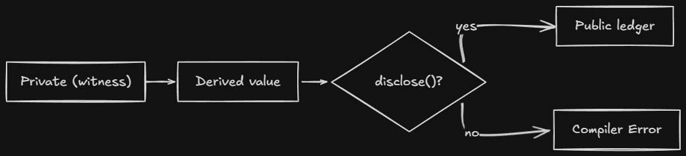

# Explicit Disclosure

Explicit disclosure is Compact's mechanism for controlling what private data flows into the public world. It is enforced at compile time by the **witness protection program**.

> Source: [docs.midnight.network/compact/reference/explicit-disclosure](https://docs.midnight.network/compact/reference/explicit-disclosure)

## The Core Rule

A Compact program must explicitly declare its intention to disclose data that might be private before:

1. Storing it in the public ledger
2. Returning it from an exported circuit
3. Passing it to another contract

**Privacy is the default, disclosure is an explicit exception.**

## The disclose() Flow



**Key points:**
- `disclose()` is a compile-time annotation only, no runtime cost
- It tells the compiler "I intentionally want this public"
- Without it, compiler error (can't accidentally leak data)

## What Counts as Witness Data

Witness data originates from:
- Return values of `witness` function calls
- Arguments passed to exported circuits
- Arguments passed to the contract constructor

Any value derived from witness data is also considered witness data, the taint follows the data everywhere.

## `disclose()`

`disclose(expr)` tells the compiler: "I know this may contain witness data, and I am intentionally disclosing it."

```compact
// Without: compiler error
export circuit record(): [] {
  balance = getBalance();
}

// With: compiles
export circuit record(): [] {
  balance = disclose(getBalance());
}
```

It has no runtime effect. It does not encrypt or transform the value. It is purely a compile-time annotation.

## The Compiler Error

```
Exception: line 6 char 11:
  potential witness-value disclosure must be declared but is not:
    witness value potentially disclosed:
      the return value of witness getBalance at line 2 char 1
    nature of the disclosure:
      ledger operation might disclose the witness value
    via this path through the program:
      the right-hand side of = at line 6 char 11
```

## Indirect Disclosure

Witness data cannot be hidden from the compiler by passing it through arithmetic, structs, or helper circuits:

```compact
circuit obfuscate(x: Field): Field {
  return x + 73;  // output is still witness data
}

export circuit record(): [] {
  const s = getBalance() as Field;
  const x = obfuscate(s);
  balance = x as Bytes<32>;  // compiler error
}
```

The compiler's abstract interpreter follows the witness taint through every operation.

## Disclosure Via Return Values

Returning witness-derived data from an exported circuit counts as disclosure:

```compact
// compiler error
export circuit balanceExceeds(n: Uint<64>): Boolean {
  return getBalance() > n;
}

// correct
export circuit balanceExceeds(n: Uint<64>): Boolean {
  return disclose(getBalance()) > n;
}
```

Even a comparison result counts as a disclosure.

## Where to Place `disclose()`

Place `disclose()` as close to the disclosure point as possible. This minimizes the scope of what you are declaring disclosed.

For structured values (tuples, vectors, structs), wrap only the portions that contain witness data:

```compact
const result = [publicValue, disclose(privateValue)];
```

## Standard Library Exceptions

| Function | Witness-tainted? | Why |
|----------|------------------|-----|
| `transientCommit(e)` | **No** | The random nonce sufficiently hides the input |
| `transientHash(e)` | Yes | Bare hash may not hide input |

```compact
// no disclose() needed
ledger commitment: Field;
export circuit commit(v: Field): [] {
  const nonce = freshNonce();
  commitment = transientCommit(v, nonce);
}

// disclose() required
ledger hashed: Field;
export circuit storeHash(v: Field): [] {
  hashed = disclose(transientHash(v));
}
```

## Quick Reference

| Scenario | Require `disclose()`? |
|----------|---------------------|
| Store witness value in ledger | Yes |
| Return witness value from exported circuit | Yes |
| Return comparison result | Yes |
| Use witness inside circuit (no disclosure) | No |
| Store `transientCommit(witnessValue)` in ledger | No |
| Store `transientHash(witnessValue)` in ledger | Yes |