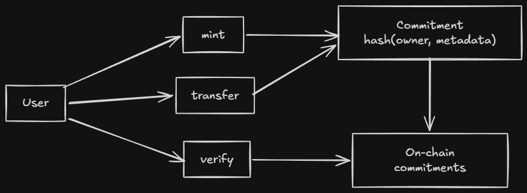

# Example Projects

This note contains working Compact contracts with detailed explanations of what each demonstrates and why the design choices matter.

---

## Intuition First

The best way to learn Compact is through working code. Each example here shows a specific pattern:

1. **NFT Contract**, Ownership transfer with commitments (the most common pattern).
2. **Collection Contract**, Constructor parameters and parameterized contracts.
3. **Bulletin Board**, Single-owner state machine with derived keys.

Study the patterns, not just the syntax. The patterns are what you'll adapt for your own contracts.

---

## NFT Contract

> **What it demonstrates:** Ownership transfer with cryptographic commitments. The owner proves ownership without revealing their private key.

### The Privacy Pattern

| What lives on-chain | What stays off-chain |
|--------------------|--------------------|
| `tokenCommitments` (hash of `owner + metadataHash`) | The actual `owner` and `metadataHash` |
| `totalSupply`, `nextTokenId` | The user's secret key |

To transfer an NFT, you prove you know the `owner` and `metadataHash` that hash to the stored commitment, without revealing them.



### The Contract

```compact
pragma language_version 0.22;

import CompactStandardLibrary;

export ledger totalSupply: Uint<64>;
export ledger nextTokenId: Uint<64>;
export ledger tokenCommitments: Map<Uint<64>, Bytes<32>>;

witness callerAddress(): Bytes<32>;

circuit hashTokenData(owner: Bytes<32>, metadataHash: Bytes<32>): Bytes<32> {
    return persistentHash<Vector<2, Bytes<32>>>([owner, metadataHash]);
}

constructor() {
    totalSupply = 0;
    nextTokenId = 1;
}

export circuit mint(metadataHash: Bytes<32>): [] {
    const caller = disclose(callerAddress());
    const tokenId = nextTokenId;
    const commitment = hashTokenData(caller, metadataHash);
    tokenCommitments.insert(tokenId, disclose(commitment));
    totalSupply = disclose((totalSupply + 1) as Uint<64>);
    nextTokenId = disclose((tokenId + 1) as Uint<64>);
}

export circuit transfer(tokenId: Uint<64>, newOwner: Bytes<32>, tokenMetaHash: Bytes<32>): [] {
    const caller = disclose(callerAddress());
    const expectedCommitment = hashTokenData(caller, tokenMetaHash);
    const pubTokenId = disclose(tokenId);
    assert(tokenCommitments.member(pubTokenId), "Token does not exist");
    const currentCommitment = tokenCommitments.lookup(pubTokenId);
    assert(currentCommitment == expectedCommitment, "Not the owner");
    const nextCommitment = hashTokenData(disclose(newOwner), tokenMetaHash);
    tokenCommitments.insert(pubTokenId, disclose(nextCommitment));
}

export circuit verifyOwnership(tokenId: Uint<64>, tokenMetaHash: Bytes<32>): [] {
    const caller = disclose(callerAddress());
    const expectedCommitment = hashTokenData(caller, tokenMetaHash);
    const pubTokenId = disclose(tokenId);
    assert(tokenCommitments.member(pubTokenId), "Token does not exist");
    const currentCommitment = tokenCommitments.lookup(pubTokenId);
    assert(currentCommitment == expectedCommitment, "Not the owner");
}
```

### Walkthrough: Mint

```
1. DApp calls mint(metadataHash)
2. callerAddress() witness returns the caller's derived address
3. hashTokenData(owner, metadataHash) computes the commitment
4. tokenCommitments.insert(tokenId, commitment) stores the commitment
5. Proof submitted: "caller knows owner that hashes to commitment"
```

The caller never reveals `owner`. They only reveal the `callerAddress` (which is public-derived from their secret key). The commitment proves they knew the private key.

### Walkthrough: Transfer

```
1. DApp calls transfer(tokenId, newOwner, tokenMetaHash)
2. callerAddress() returns the current owner's address
3. hashTokenData(caller, tokenMetaHash) recomputes the expected commitment
4. lookup(tokenId) gets the stored commitment
5. assert(current == expected) verifies the caller is the owner
6. hashTokenData(newOwner, tokenMetaHash) computes the new commitment
7. insert(tokenId, newCommitment) updates ownership
```

The transfer proves the caller owned the NFT and authorizes the transfer to a new owner, without revealing the private keys.

### Why This Pattern Works

The commitment pattern is the key insight:

```
commitment = hash(owner + metadataHash)
stored on-chain: commitment
off-chain: owner, metadataHash
```

Even if everyone knows the `metadataHash` and sees the `commitment`, they cannot derive the `owner` without knowing the secret key.

---

## Collection Contract

> **What it demonstrates:** Constructor parameters. The contract is initialized with fixed parameters (name, description, max supply) that are set at deployment.

### The Pattern

```compact
pragma language_version 0.22;

import CompactStandardLibrary;

export ledger collectionName: Bytes<32>;
export ledger collectionDescription: Bytes<64>;
export ledger creator: Bytes<32>;
export ledger maxSupply: Uint<64>;
export ledger totalSupply: Uint<64>;
export ledger nextTokenId: Uint<64>;
export ledger tokenCommitments: Map<Uint<64>, Bytes<32>>;

witness callerAddress(): Bytes<32>;

constructor(name: Bytes<32>, desc: Bytes<64>, cap: Uint<64>) {
    collectionName = disclose(name);
    collectionDescription = disclose(desc);
    maxSupply = disclose(cap);
    creator = disclose(callerAddress());
    totalSupply = 0;
    nextTokenId = 1;
}

export circuit mint(metadataHash: Bytes<32>): [] {
    assert(totalSupply < maxSupply, "Supply reached");
    const caller = disclose(callerAddress());
    const commitment = hashTokenData(caller, metadataHash);
    tokenCommitments.insert(nextTokenId, disclose(commitment));
    totalSupply = disclose((totalSupply + 1) as Uint<64>);
    nextTokenId = disclose((nextTokenId + 1) as Uint<64>);
}
// ... transfer and verifyOwnership same as NFT contract
```

### What Changes

| Element | Change from NFT |
|---------|-----------------|
| Constructor | Takes parameters: name, desc, cap |
| `maxSupply` | Enforces the cap in `mint` |
| `creator` | Records who deployed the collection |
| `collectionName/Description` | Human-readable metadata |

### Constructor Parameters

Constructor parameters come from the deploying transaction. They're disclosed at initialization, so the initial state is fully public.

This is the right model for collections, where the metadata should be public and fixed.

---

## Bulletin Board Contract

> **What it demonstrates:** Single-owner state machine with derived public keys. The owner proves ownership by deriving the same public key from their secret.

### The Pattern

```compact
pragma language_version 0.20;

import CompactStandardLibrary;

export enum State { VACANT, OCCUPIED }

export ledger state: State;
export ledger message: Maybe<Opaque<"string">;
export ledger sequence: Counter;
export ledger owner: Bytes<32>;

constructor() {
  state = State.VACANT;
  message = none<Opaque<"string">>();
  sequence.increment(1);
}

witness localSecretKey(): Bytes<32>;

export circuit post(newMessage: Opaque<"string">): [] {
  assert(state == State.VACANT, "Board occupied");
  owner = disclose(publicKey(localSecretKey(), sequence as Field as Bytes<32>));
  message = disclose(some<Opaque<"string">>(newMessage));
  state = State.OCCUPIED;
}

export circuit takeDown(): Opaque<"string"> {
  assert(state == State.OCCUPIED, "Board empty");
  assert(owner == publicKey(localSecretKey(), sequence as Field as Bytes<32>), "Not owner");
  const msg = message.value;
  state = State.VACANT;
  sequence.increment(1);
  message = none<Opaque<"string">>();
  return msg;
}

pure circuit publicKey(sk: Bytes<32>, seq: Bytes<32>): Bytes<32> {
  return persistentHash<Vector<3, Bytes<32>>>([pad(32, "bboard:pk:"), seq, sk]);
}
```

### Walkthrough: Post

```
1. State must be VACANT (board is empty)
2. Derive public key from secretKey + sequence
3. Store the public key as owner
4. Store the message (disclosed)
5. Set state to OCCUPIED
```

### Walkthrough: TakeDown

```
1. State must be OCCUPIED (board has a message)
2. Derive public key from secretKey + sequence
3. assert(derived == stored) verifies caller is the owner
4. Return and clear the message
5. Set state back to VACANT
```

### Why Sequence Matters

The `sequence` counter is part of the public key derivation. This prevents replay attacks, the same secret key produces a different public key for each message.

Without sequence, an attacker who saw the first message could derive the same public key and post as the owner.

---

## Using in a DApp

### TypeScript Setup

```typescript
import { findDeployedContract } from '@midnight-ntwrk/midnight-js-contracts';
import { createWallet, createProviders } from './utils.js';

async function mint(contractAddress: string, metadata: string) {
  const wallet = await createWallet(seed);
  const providers = await createProviders(wallet);

  const callerAddressBytes = crypto.createHash('sha256')
    .update(walletAddressString).digest();

  const contract = await findDeployedContract(providers, {
    contractAddress,
    compiledContract: await getCompiledNFTContract('contract', callerAddressBytes),
  });

  const metadataHash = crypto.createHash('sha256').update(metadata).digest();

  const tx = await contract.callTx.mint(metadataHash);
  console.log(`Minted! Transaction: ${tx}`);
}
```

### Key Points

1. **`callerAddressBytes`** is derived from the wallet address, this is the witness input.
2. **`metadataHash`** is computed from the metadata, anyone can verify this later.
3. **`callTx.mint()`** generates the proof and submits the transaction.
4. **`findDeployedContract()`** connects to the deployed contract on-chain.

---

## More Examples

- [midnight-awesome-dapps](https://github.com/midnightntwrk/midnight-awesome-dapps), Official examples
- Midnight Discord `#dev-showcase`, Community projects

---

## Quick Recap

- **NFT Contract**, Commitment pattern for ownership without revealing secrets.
- **Collection Contract**, Constructor parameters for parameterized deployment.
- **Bulletin Board**, Derived public keys + sequence for single-owner state machine.
- **Constructor**, Runs once at deployment, sets initial state.
- **Witness**, Provides private input (your secret key) without touching the chain.
- **`disclose()`**, Marks intentional disclosure (owner address, message, etc.).
- **`hashTokenData`**, Commits to `owner + metadataHash` without revealing either.
- **Sequence**, Prevents replay by making each public key unique.

---

## Cross-Links

- **See also:** [Writing a Contract](./03.%20Writing%20A%20Contract.md), Contract structure
- **See also:** [Ledger State](./04.%20Ledger%20State.md), Commitment pattern
- **See also:** [Witnesses](./06.%20Witnesses.md), Private input mechanism
- **See also:** [Explicit Disclosure](./07.%20Explicit%20Disclosure.md), Disclosure boundary